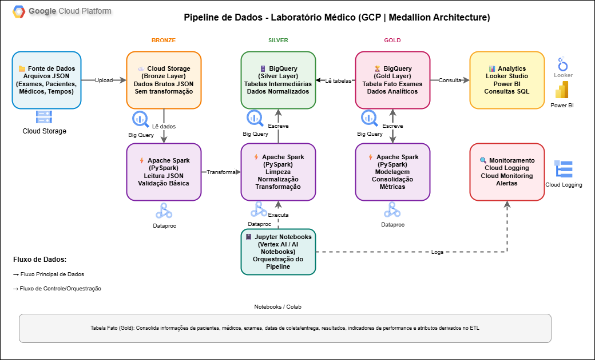

# Pipeline de Dados para Laboratório Médico com Arquitetura Medallion no GCP

## 1. Visão Geral do Projeto

Este projeto demonstra a implementação de um pipeline de dados robusto e escalável para um laboratório médico, utilizando a arquitetura **Medallion** no **Google Cloud Platform (GCP)**. O objetivo é processar, enriquecer e modelar dados brutos provenientes de exames, pacientes e médicos, transformando-os em insights acionáveis e prontos para análise.

A solução ingere arquivos JSON, processa-os de forma distribuída com **Apache Spark** e os armazena em camadas distintas no **BigQuery**, seguindo as melhores práticas de engenharia de dados para garantir qualidade, rastreabilidade e governança.

## 2. Arquitetura da Solução

O fluxo de dados foi desenhado seguindo o padrão **Medallion**, que organiza o pipeline em três camadas lógicas: **Bronze**, **Silver** e **Gold**. Cada camada tem uma responsabilidade específica, desde a ingestão de dados brutos até a entrega de modelos de dados otimizados para consumo analítico.



### Camada Bronze: A Fonte da Verdade

- **Função**: Armazenar os dados brutos, exatamente como foram recebidos da fonte, sem nenhuma alteração. Esta camada serve como um repositório de dados imutável, garantindo a rastreabilidade e a capacidade de reprocessar o pipeline a qualquer momento.
- **Tecnologia**: Os arquivos JSON são recebidos e armazenados no **Google Cloud Storage**.
- **Processo**: Uma vez no Cloud Storage, os dados são lidos por um job **Apache Spark (PySpark)** que realiza uma validação estrutural básica antes de movê-los para a próxima fase.

### Camada Silver: Dados Enriquecidos e Confiáveis

- **Função**: Transformar os dados brutos em um formato limpo, padronizado e enriquecido. Nesta fase, são aplicadas regras de negócio, limpeza de dados (tratamento de nulos, duplicatas), normalização e junção de diferentes fontes de dados.
- **Tecnologia**: O processamento é realizado com **Apache Spark**, e os dados tratados são persistidos como tabelas intermediárias no **BigQuery**.
- **Processo**: O Spark executa transformações como a conversão de tipos de dados, padronização de formatos de data e a criação de chaves para relacionamentos entre as tabelas.

### Camada Gold: Insights e Modelagem de Negócio

- **Função**: Consolidar os dados da camada Silver em modelos de dados agregados e otimizados para análise de negócio (Business Intelligence) e ciência de dados. É nesta camada que a **Tabela Fato** é construída.
- **Tecnologia**: Os dados são modelados e armazenados em tabelas no **BigQuery**, prontas para serem consumidas por ferramentas de visualização ou modelos de machine learning.
- **Processo**: Jobs Spark ou queries SQL no BigQuery agregam os dados para criar métricas de performance, indicadores chave (KPIs) e a tabela fato central, que consolida informações de exames, pacientes e médicos.

## 3. Tabela Fato (Fato_Exames)

A principal entrega da camada Gold é a tabela `Fato_Exames`, um modelo dimensional que centraliza as informações mais relevantes para a análise do negócio. Ela é projetada para responder a perguntas como:

- Qual o tempo médio entre a coleta e a entrega de resultados por tipo de exame?
- Quais médicos solicitam mais exames?
- Qual a distribuição de resultados de exames por região ou perfil de paciente?

| Campo                  | Descrição                                                                 |
| ---------------------- | ------------------------------------------------------------------------- |
| `id_paciente`          | Identificador único do paciente.                                          |
| `id_medico`            | Identificador único do médico solicitante.                                |
| `id_exame`             | Identificador único do tipo de exame.                                     |
| `data_coleta`          | Data e hora em que a amostra foi coletada.                                |
| `data_entrega`         | Data e hora em que o resultado foi entregue.                              |
| `resultado`            | O valor ou laudo do resultado do exame.                                   |
| `tempo_processamento`  | Métrica calculada da diferença entre a coleta e a entrega (em horas).     |
| `custo_exame`          | Custo associado ao exame.                                                 |

## 4. Tecnologias Utilizadas

| Categoria              | Ferramenta/Serviço                                    | Propósito                                                                 |
| ---------------------- | ----------------------------------------------------- | ------------------------------------------------------------------------- |
| **Armazenamento**      | Google Cloud Storage                                  | Repositório para dados brutos (JSON) na camada Bronze.                    |
| **Data Warehouse**     | Google BigQuery                                       | Armazenamento das tabelas nas camadas Silver e Gold.                      |
| **Processamento**      | Apache Spark (PySpark)                                | Motor de processamento distribuído para ETL entre as camadas.             |
| **Orquestração**       | Vertex AI Notebooks (Jupyter)                         | Ambiente de desenvolvimento e execução manual dos scripts Spark.          |
| **Linguagens**         | Python, SQL                                           | Linguagens para desenvolvimento dos scripts de ETL e consultas.           |

## 5. Estrutura do Repositório

```
/
├── notebooks/                  # Notebooks Jupyter com a lógica de ETL
│   ├── 1_bronze_ingestion.ipynb
│   ├── 2_silver_transformation.ipynb
│   └── 3_gold_modeling.ipynb
|
├── sql/                        # Scripts SQL para consultas e criação de tabelas
│   └── create_fact_table.sql
|
├── docs/                       # Documentação e diagramas
│   └── arquitetura_gcp_medallion.drawio
|
└── README.md                   # Este arquivo
```

## 6. Próximos Passos e Evoluções

Este projeto estabelece uma base sólida que pode ser expandida com funcionalidades mais avançadas, tais como:

- **Orquestração Automatizada**: Substituir a execução manual por um orquestrador como o **Cloud Composer (Airflow)** para agendar e monitorar os pipelines.
- **Monitoramento e Alertas**: Implementar o **Cloud Monitoring** para criar alertas sobre falhas no pipeline ou anomalias nos dados.
- **Dashboards Interativos**: Conectar ferramentas como **Looker Studio** ou **Power BI** à camada Gold para criar painéis de visualização.
- **Machine Learning**: Utilizar os dados da camada Gold para treinar modelos preditivos com **Spark MLlib** ou **BigQuery ML**, como a previsão de demanda por exames.
